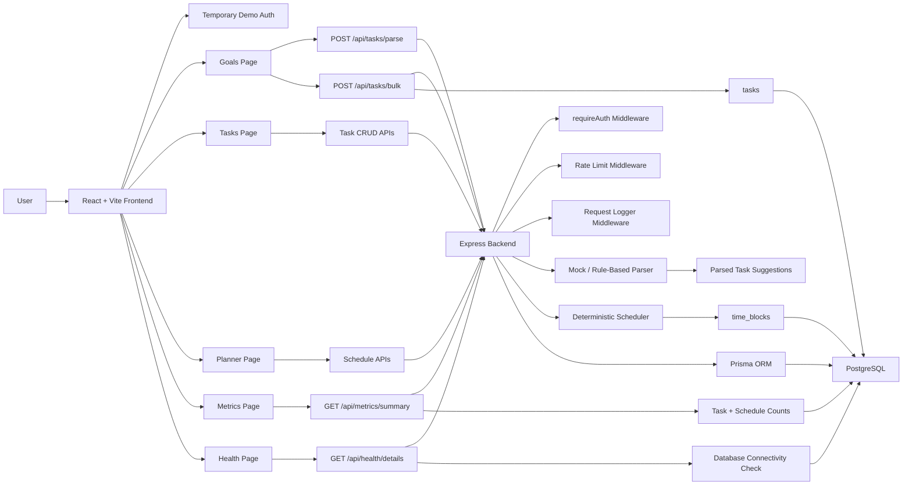

# ChronoSync Architecture Diagram

This document describes the current local MVP architecture.

## System Diagram

## Main Runtime Flow

1. User signs in with the temporary demo auth flow.
2. Frontend sends requests with the `x-user-email` header.
3. Express middleware resolves the current user.
4. User enters messy goals on the Goals page.
5. Backend mock parser converts text into structured task suggestions.
6. User edits parsed tasks before saving.
7. Frontend bulk-saves reviewed tasks.
8. Planner page generates a weekly schedule.
9. Backend scheduler creates `time_blocks` and updates task statuses.
10. Metrics and health pages expose operational visibility.

## Backend Layers

- `routes/` maps HTTP endpoints to controllers.
- `controllers/` handle request and response shape.
- `services/` hold business logic for auth, tasks, parsing, scheduling, and metrics.
- `middleware/` handles auth, request logging, and rate limiting.
- `lib/prisma.ts` exposes the Prisma client.

## Frontend Layers

- `routes/AppRouter.tsx` defines app navigation.
- `components/AppLayout.tsx` provides the shared shell.
- `context/AuthContext.tsx` stores temporary demo auth.
- `services/api.ts` centralizes backend API calls and error handling.
- `pages/` contains Goals, Planner, Tasks, Metrics, Health, and Login screens.

## Current Temporary Pieces

- Auth uses a demo user and `x-user-email`; Firebase Auth will replace it later.
- Parsing uses a mock/rule-based parser; OpenAI can replace the parser service later.
- Rate limiting is in-memory; Redis can replace it for multi-instance deployment later.
- Planner uses agenda-style cards; FullCalendar can replace or augment this UI later.

## Production-Readiness Signals Already Present

- normalized PostgreSQL schema through Prisma
- user-scoped protected routes
- rate limiting for heavier routes
- request logging with response times
- DB-aware health check
- metrics summary endpoint and frontend metrics dashboard
- deterministic scheduler separate from AI parsing
